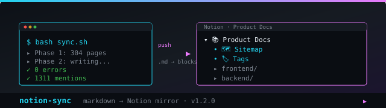
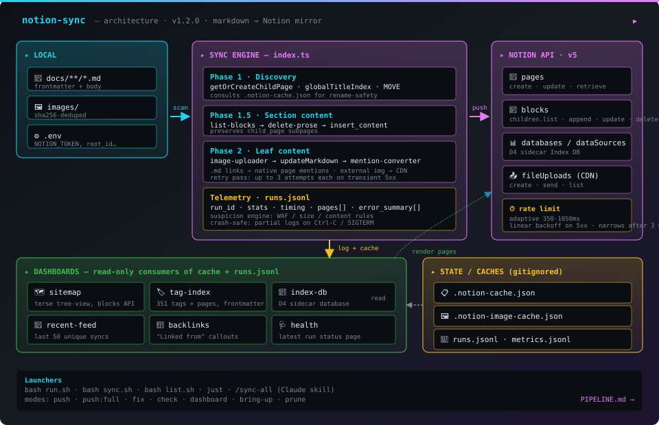

<div align="center">



</div>

<h1 align="center">notion-sync</h1>

<p align="center">
  Push markdown docs to Notion — folder structure, icons, covers, mentions, dashboards, audit logs.
</p>

<p align="center">
  
  
  
  
  
</p>

<details>
<summary align="center"><b>The terminal banner — what each run looks like</b> (click to expand)</summary>

```
╔==================================================================╗
║  +--⊕ NOTION-SYNC ⊕--+                                           ║
║  |  markdown → Notion mirror|                                    ║
║  +-------------------+                                           ║
╠==============◆◆====================================◆◆============╣
║                                                                  ║
║  ◆ SYNC -------------------------------------------------------  ║
║  ├- two-phase: discover → write content                          ║
║  ├- adaptive linear backoff (350-1050ms)                         ║
║  ├- auto-unarchive Phase 1 (in_trash + archived)                 ║
║  └- Phase 2 retry pass (up to 3 attempts each)                   ║
║                                                                  ║
║  ◇ DASHBOARDS -------------------------------------------------  ║
║  ├- Sitemap     — terse tree-view of every page                  ║
║  ├- Tag index   — frontmatter tags, searchable                   ║
║  ├- Doc Index   — sidecar DB with multi-select views             ║
║  └- Recently    — feed of last-synced changes                    ║
║                                                                  ║
║  ▶ AUDIT ------------------------------------------------------  ║
║  ├- runs.jsonl  — per-run config + stats + errors                ║
║  ├- metrics     — rolling per-API-call timing                    ║
║  ├- partial logs on Ctrl-C / SIGTERM / crash                     ║
║  └- list.sh recent-errors — copy-paste retry hint                ║
║                                                                  ║
╠==============◆◆====================================◆◆============╣
║  ⊙ v1.3.0  ·  bash sync.sh  ·  bash sync.sh reconcile           ║
╚==================================================================╝
```

</details>

---

> **Standalone tool.** Has its own `package.json`, `node_modules`, and `tsconfig.json`. Not imported by or built with the Next.js frontend app. Run locally with `bash sync.sh` or trigger manually via GitHub Actions.

## Quick start

```bash
# 1. Copy env template and fill in credentials
cp .env.example .env

# 2. Dry run — preview without writing to Notion
bash sync.sh --dry-run

# 3. Full sync
bash sync.sh

# 4. Sync only specific files or folders
bash sync.sh --only jobs
bash sync.sh --only auth-flow e2e-get-started
```

See [SETUP.md](SETUP.md) for one-time Notion integration setup, and [USAGE.md](USAGE.md) for a task-oriented guide covering every scenario (selective sync, image upload, mentions, diff, retry, performance tuning, etc.).

> **Pipeline at a glance:** [PIPELINE.md](PIPELINE.md) — full end-to-end diagram (discovery → sections → leaf content → dashboards → prune) with the rename-safety move detection and the cache/runs flow. Re-render any time with `bash scripts/render-pipeline-diagram.sh`.

## Commands

Two scripts cover everything. Each row links to the relevant USAGE section.

### `sync.sh` — push local docs → Notion

| Command | What it does | Details |
|---|---|---|
| `bash sync.sh` | Interactive wizard (pick mode, filter, options) | [§1 Daily sync](USAGE.md#1-daily-sync-workflow) |
| `bash sync.sh --no-wizard` | Use saved defaults from last run | [§1](USAGE.md#1-daily-sync-workflow) |
| `bash sync.sh --dry-run` | Preview without writing | [§3 Dry-run](USAGE.md#3-dry-run-preview) |
| `bash sync.sh --only X Y …` | Sync only matching sections / files | [§2 Selective sync](USAGE.md#2-selective-sync) |
| `bash sync.sh --verbose` | Per-file output instead of progress bar | [§11 Performance tuning](USAGE.md#11-performance-tuning) |
| `bash sync.sh --fix-mentions` | Skip sync; convert internal links → page mentions | [§8 Mentions](USAGE.md#8-internal-links--page-mentions) |
| `bash sync.sh reconcile` | 🛡 Resolve guardrail-protected pages from last sync (interactive) | [§11.5 Guardrails](USAGE.md#115-overwrite-guardrails--reconciliation) |
| `bash sync.sh reconcile <path>` | Reconcile a single page (matches like `--only`) | [§11.5](USAGE.md#115-overwrite-guardrails--reconciliation) |
| `bash sync.sh -h` | Inline help | — |

### `list.sh` — read remote, diff, batch-fix

| Command | What it does | Details |
|---|---|---|
| `bash list.sh` | Render cached remote tree (auto-fetches if no cache) | [§4 Verifying remote](USAGE.md#4-verifying-remote-state) |
| `bash list.sh fetch` | Refresh cache from Notion (~6 min for ~300 pages) | [§4](USAGE.md#4-verifying-remote-state) |
| `bash list.sh fetch --no-icons` | Faster fetch, skip per-page icon retrieval | [§4](USAGE.md#4-verifying-remote-state) |
| `bash list.sh show --max-depth N` | Collapse tree beyond depth N | [§4](USAGE.md#4-verifying-remote-state) |
| `bash list.sh show --empty-only` | Only pages with 0 content blocks | [§4](USAGE.md#4-verifying-remote-state) |
| `bash list.sh diff` | Title-based comparison vs local docs | [§5 Comparing](USAGE.md#5-comparing-local-vs-remote) |
| `bash list.sh empty-paths` | Print local paths whose remote page is empty | [§5](USAGE.md#5-comparing-local-vs-remote) |
| `bash list.sh fix-mentions` | Standalone: rewrite links → mentions on every cached page | [§8 Mentions](USAGE.md#8-internal-links--page-mentions) |

### Common workflows

```bash
# First sync after a long time
bash list.sh fetch                                # snapshot remote
bun compare-apr-30-1/compare.ts                   # path-based diff vs local
bash sync.sh                                      # full sync (wizard)
bash list.sh fix-mentions                         # convert legacy links

# Daily one-file change
bash sync.sh --no-wizard --only create-scraper

# Mop up empty remote pages
bash sync.sh --no-wizard --only $(bash list.sh empty-paths)
```

## What it does

Mirrors a local docs folder to Notion as nested pages, maintaining the full folder hierarchy:

```
docs/
├── overview.md              → leaf page under root
├── product/                 → "Product" section page (auto-indexed)
│   ├── _index.md            → content for the "Product" section page
│   ├── auth-flow.md         → child page
│   └── app/                 → "App" section page
│       └── auth-flow.md     → nested child page
└── system/                  → "System" section page
```

**Two-phase sync** — phase 1 discovers / creates all Notion pages and builds a `relPath → pageId` map; phase 2 writes content with cross-file links already resolved. This means links between any two docs always point to the right Notion page, even across sections.

**Idempotent** — pages are looked up by title under their parent. Repeated runs update content in place and never create duplicates.

## Overwrite guardrails 🛡 (v1.3)

Stops `notion-sync` from silently overwriting human edits, page moves, or archival in Notion.

After every successful push, a per-page baseline is recorded in `.notion-sync-state.json` (`last_edited_time` + parent + block count, plus the integration's bot user id). Before the next push, every known page is re-checked against current Notion state. Detected divergence kinds:

| Kind | Means |
|---|---|
| `user-edited` | A human (not the integration bot) edited the page after the last sync |
| `moved` | The page's parent changed |
| `moved-out` | The page is now outside the synced root |
| `archived` | The page is in Notion's Trash |
| `benign-drift` | `last_edited_time` advanced but our bot is still the last editor (soft warning) |

Default mode `strict` skips protected pages and reports them at end of run. Modes `warn` and `off` are available via `NOTION_GUARDRAILS=...` or the wizard.

**Resolve protected pages with `bash sync.sh reconcile`** — an interactive walk through every protected page with kind-specific menus:

- **`user-edited`**: View diff first / Pull Notion → local (preserve human edits) / Keep local — overwrite Notion / Skip
- **`moved`**: Accept the move / Move it back to expected parent / Skip
- **`archived`**: Accept the archive / Force-recreate at original location / Skip

Per-page CLI escape hatches (`--force-overwrite`, `--accept-move`, `--accept-archive`) skip the wizard. The pull path uses Notion's `pages.retrieveMarkdown` endpoint and converts mention tags back to plain markdown links so the next sync round-trips cleanly.

Full UX walkthrough in [USAGE.md §11.5](USAGE.md#115-overwrite-guardrails--reconciliation). Design rationale in [OVERWRITE-GUARDRAILS-EXPLORATION.md](OVERWRITE-GUARDRAILS-EXPLORATION.md) and [RECONCILIATION-EXPLORATION.md](RECONCILIATION-EXPLORATION.md).

## Architecture

<div align="center">



</div>

> Three concentric loops: **engine** (push) → **Notion API** → **cache** → **dashboards** (read). Caches are gitignored, runs.jsonl is append-only telemetry. For the line-by-line gum-rendered pipeline (Phase 1.5 sections, retry semantics, prune subcommands), see [PIPELINE.md](PIPELINE.md).

**Module responsibilities:**

| Module                  | Owns                                                                                  |
| ----------------------- | ------------------------------------------------------------------------------------- |
| `sync.sh`               | wizard, env validation, defaults file, completion notification, `reconcile` dispatch  |
| `index.ts`              | Phase 1 discovery, Phase 1.5 sections, **Phase 1.7 guardrail check**, Phase 2 leaf writes, retry passes, run logging |
| `sync-state.ts`         | `.notion-sync-state.json` baseline tracking, bot-id cache, `checkDivergence` (returns all applicable kinds), `recordPageBaseline` |
| `reconcile.ts`          | Interactive guided resolution of protected pages — kind-specific menus, ← Back nav, live re-check, pull-from-Notion path |
| `image-uploader.ts`     | sha256 dedup cache, fileUploads create+send, post-write image-block external→file_upload swap |
| `mention-converter.ts`  | walk page blocks, rewrite text-link annotations → page mentions                       |
| `notion-list.ts`        | walk Notion tree, save cache, render show/diff/empty-paths/fix-mentions               |
| `list.sh`               | wraps notion-list.ts; notification on long subcommands                                |

## Folder indexes (`_index.md`)

Drop a `_index.md` file in any folder to control that folder's section page:

```markdown
---
icon: 📦
---

# Product Docs

Overview text, a curated table of contents, See Also links — whatever you want
shown when someone lands on the section page.
```

- The `icon:` frontmatter sets the section page icon in Notion.
- The body becomes the section page content (after link + image rewriting).
- `_index.md` files are **never** synced as their own separate Notion pages.
- Folders **without** `_index.md` get an auto-generated index (child doc table with status + audience, subsection counts).

## Page metadata (frontmatter)

Any `.md` file can have a frontmatter block:

```markdown
---
icon: 📋
cover: https://images.unsplash.com/photo-xxx?w=1200
status: stable
audience: engineering
last_updated: 2026-04-24
---

# Page Title
```

| Field          | Effect                                                      |
| -------------- | ----------------------------------------------------------- |
| `icon`         | Emoji or `https://` URL → Notion page icon                  |
| `cover`        | `https://` URL → Notion page cover image                    |
| `status`       | Shown in metadata banner + auto-index tables                |
| `audience`     | Shown in metadata banner + auto-index tables                |
| `last_updated` | Shown in metadata banner                                    |

The frontmatter block is stripped before content is sent to Notion. Status + audience + last_updated are prepended as a blockquote banner at the top of each synced page.

## Folder mapping (`NOTION_SYNC_MAP`)

Route different top-level folders to separate Notion root pages:

```json
// sync-map.json
{
  "product": "Product-Docs-34abacd27dee80f3be8fe230c7d1ff9d",
  "boring-technical-stuff": "Eng-Docs-34abacd27dee80f3be8fe230c7d1ff9d"
}
```

```
NOTION_SYNC_MAP=./sync-map.json
```

Mapped folders bypass the default root and root their subtree directly under the mapped Notion page.

## Environment variables

| Variable                     | Required | Default            | Description                                                       |
| ---------------------------- | -------- | ------------------ | ----------------------------------------------------------------- |
| `NOTION_TOKEN`               | yes      | —                  | Integration secret (`secret_...` or `ntn_...`)                    |
| `NOTION_ROOT_PAGE_ID`        | yes      | —                  | ID or URL slug of the root Notion page                            |
| `DOCS_DIR`                   | yes      | `./docs`           | Absolute path to the local docs folder to sync                    |
| `GITHUB_REPO`                | no       | —                  | `owner/repo` — used for link fallbacks + image URLs               |
| `GITHUB_BRANCH`              | no       | `development`      | Branch for GitHub URLs                                            |
| `GITHUB_DOCS_ROOT`           | no       | `frontend/docs`    | Repo-relative path matching `DOCS_DIR`, for image URL building    |
| `GITHUB_DOCS_PATH`           | no       | `frontend/docs`    | Repo-relative path for markdown link fallbacks                    |
| `GITHUB_DOC_SOURCE_URL_BASE` | no       | computed           | Override for the per-doc "View source on GitHub" breadcrumb link  |
| `NOTION_LINK_MODE`           | no       | `notion`           | `notion` \| `github` \| `strip` — how `.md` links are rewritten   |
| `NOTION_PAGE_ICON`           | no       | —                  | Default emoji for leaf pages without `icon:` frontmatter          |
| `NOTION_FOLDER_ICON`         | no       | —                  | Default emoji for section pages without `_index.md`               |
| `NOTION_SHOW_META`           | no       | on                 | Set `0` to suppress the frontmatter banner on each page           |
| `NOTION_UPLOAD_IMAGES`       | no       | off                | `1` to upload images to Notion's CDN — required for private repos |
| `NOTION_USE_MENTIONS`        | no       | on                 | `0` to disable internal-link → page-mention conversion            |
| `NOTION_GUARDRAILS`          | no       | `strict`           | `strict` \| `warn` \| `off` — overwrite protection for human-edited pages (v1.3) |
| `NOTION_SYNC_MAP`            | no       | —                  | Path to JSON file mapping top-level folders to Notion roots       |
| `ABORT_POLICY`               | no       | `disabled`         | `disabled` \| `1` \| `2` \| `3` \| `5` \| `10` (consecutive errors) |
| `DRY_RUN`                    | no       | —                  | Set `1` to preview without writing                                |
| `VERBOSE`                    | no       | —                  | Set `1` for per-file output instead of progress bar               |

> `NOTION_FULL_WIDTH` is intentionally unused — `is_full_width` is **not settable via Notion's public REST API**. Verified 2026-05-01 across `format.full_width`, `is_full_width`, `page.full_width`, `format.is_full_width` shapes — all return `validation_error: body.X should be not present`. Notion strips the field from both reads and writes. Workarounds: toggle per-page in the Notion UI; or use a userscript / browser extension to auto-toggle on page load. Database views (D4 sidecar Index DB, future feature) render wide by default and partially address this.

## Link and image rewriting

**Links:** Relative `.md` links are rewritten during phase 2 based on `NOTION_LINK_MODE`:

| Mode               | Behaviour                                                       |
| ------------------ | --------------------------------------------------------------- |
| `notion` (default) | Rewrites to Notion page URL; falls back to GitHub URL if needed |
| `github`           | Always rewrites to GitHub viewer URL                            |
| `strip`            | Removes the link, leaves plain text                             |

After Phase 2 writes a page's content, internal `.md` links pointing at our synced pages are converted to **native Notion page mentions** — inline pills with hover-preview, side-peek navigation, and auto-updating titles. Disable via `NOTION_USE_MENTIONS=0`. See [USAGE §8](USAGE.md#8-internal-links--page-mentions) for the tradeoff (mentions display the linked page's current title, not the original anchor text).

**Images:** Relative image paths (`./images/foo.png`) are rewritten to `raw.githubusercontent.com` URLs using `GITHUB_REPO`, `GITHUB_BRANCH`, and `GITHUB_DOCS_ROOT`. For **private repos**, those URLs return 404 to Notion — set `NOTION_UPLOAD_IMAGES=1` to upload each image to Notion's CDN and swap the image block from `external` → `file_upload` after the markdown write. Uploads are sha256-cached in `.notion-image-cache.json` so re-runs and renames don't re-upload. See [USAGE §7](USAGE.md#7-image-uploads-for-private-repos).

## Failure handling

- **Per-item failures** are collected during the main loop, then a **retry pass** (up to 3 attempts each) runs at the end of Phase 1.5 and Phase 2 — handles transient 502s and timeouts.
- **Adaptive linear backoff** — rate limit widens on every API failure (350ms → 1050ms over 3 steps), narrows after 3 consecutive successes. Linear, not exponential, so a single blip doesn't slingshot the rate for the rest of the run.
- **Systemic abort** — configurable via `ABORT_POLICY` (1, 2, 3, 5, 10 consecutive failures). Disabled by default — collect every error, finish the run.
- **Retry command** — printed at the end of run for any items still failing after 3 attempts: `bash sync.sh --only file1 file2`.
- **Suspicion rules** — on any push failure, file content is checked against WAF + size rules. Findings appear in the per-file error log and `runs.jsonl` `error_summary[].suspicions`.
- **Crash-safe partial cache** — `list.sh fetch` saves a partial cache on SIGINT or unhandled error so 88 pages of progress aren't lost to a single 502.
- **Crash-safe partial run logs** — Ctrl-C / SIGTERM / uncaught exception during `sync.sh` flushes a `partial: true` entry to `runs.jsonl` with `partial_reason` recording the cause. Use `bash list.sh recent-errors` to see what got done before the kill.
- **Archived-page handling** — pages deleted in Notion between runs are detected in Phase 1 (`pages.retrieve` checks `in_trash || archived`) and treated as non-existent, so a fresh page is created. Background: [RCA-ARCHIVED-PAGES.md](RCA-ARCHIVED-PAGES.md).

## Run logs

Every run appends a JSON entry to `runs.jsonl`. Each entry includes:
- `run_id` — `YYYYMMDD-HHmmss` slug for easy reference
- `config` — full snapshot of all settings active during the run
- `timing` — `phase1_ms` (discovery) + `phase2_ms` (content writes)
- `pages` — per-file results with status, elapsed time, and suspicion diagnoses
- `sections` — per-folder section page write results
- `error_summary` — quick list of failed paths + suspicion names

Ask Claude to analyse a run: _"Read the latest entry in runs.jsonl and tell me what failed and why."_

## Excluded files

Files matching `_*.md` (except `_index.md` which is used for folder metadata) and `*.claude.md` are skipped.

## GitHub Actions

The workflow at `.github/workflows/notion-sync.yaml` exists but the **push trigger is disabled** — it won't run on commits automatically. Trigger it manually via **Actions → Sync docs to Notion → Run workflow**.

---
